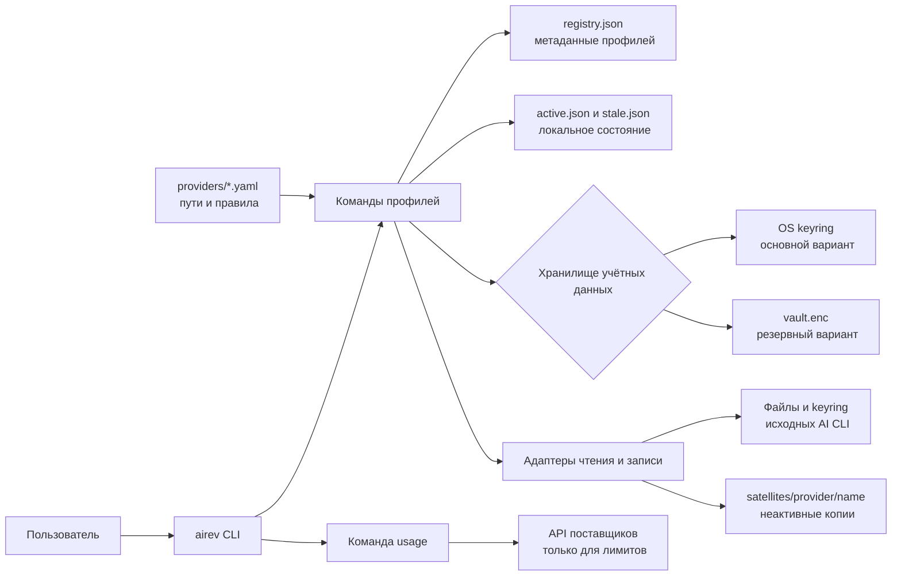

# Архитектура ai-revolver

## Назначение и границы

`ai-revolver` связывает локальное хранилище профилей с credential surface уже
установленных AI CLI. Он не управляет provider account, подпиской, MFA или
серверным состоянием поставщика.

Provider manifest отвечает за путь, формат, mapping, identity и доступные
сетевые probes. Общие команды не должны встраивать отдельный формат поставщика,
если его можно описать manifest или ограниченным adapter.

## Компоненты

Схема отрисована и проверена через Mermaid Chart.

## Зоны ответственности

| Компонент | Принимает | Создаёт или изменяет | Не отвечает за |
|---|---|---|---|
| CLI parser | аргументы процесса | нормализованные positional args и options | shell quoting до запуска процесса |
| Provider loader | YAML manifest | проверенный provider contract | стабильность внешнего формата |
| Commands | provider, profile, options | последовательность guarded operations | вход и MFA у поставщика |
| Registry | имя, provider, auth type | profile id, active и stale state | хранение токенов |
| Vault | `VaultEntry` | keyring entry или `vault.enc` | защита уже раскрытого plaintext в процессе |
| Reader/writer | manifest и credential data | нормализованные поля или атомарный файл | server-side token validity |
| Usage | профиль и usage manifest | текущий snapshot, иногда refreshed credentials | billing и точность provider UI |

## Состояние на диске

`registry.json` хранит profile names, providers, auth types, ids и timestamps.
Имя профиля может само содержать персональные данные, поэтому registry нельзя
считать публичным только из-за отсутствия токенов.

`active.json` связывает provider с активным profile id. `stale.json` хранит
локальное наблюдение о недействующих credentials. Эти файлы не входят в export
как credential data.

Vault содержит `credentials`, `grab_data`, identity snapshot и freshness.
Основной backend выбирается по платформе и доступности:

- Windows: DPAPI для текущего пользователя;
- Linux: Secret Service через `secret-tool`;
- macOS: Keychain через `security`;
- fallback: AES-256-GCM envelope в `vault.enc`, ключ выводится из пароля через
  `scrypt`.

Если keyring доступен, но пуст, а `vault.enc` существует, CLI открывает
encrypted-file backend. Команды `vault status`, `vault passwd` и `vault migrate`
используют тот же порядок выбора.

## Запись credential file

Reader нормализует поля по manifest. Writer сохраняет неизвестные поля, если
это разрешает manifest, и выполняет атомарную замену файла. Чувствительные
поля проходят merge policy: пустой `refresh_token` не удаляет непустое значение.

Перед обычным `sync` сравниваются identity и freshness. Для provider без поля
`last_refresh` используется mtime файла. Перед записью vault в файл выполняется
повторная проверка freshness, чтобы обнаружить конкурентную ротацию.

Identity resolver читает основной credential file и объявленные companion
fields. Manifest может нормализовать identity через JWT claim или SHA-256 и
разрешить пересечение полей для satellite без глобального companion file.

`qodercli` является исключением по формату: его credential хранится как
непрозрачный blob. В identity участвует только digest; diagnostics выводят
постоянную безопасную метку. Copilot token проходит через bundled token-store
runtime текущего Copilot CLI, а не через предположение о расположении keytar.

## Сетевые границы

`list`, `status`, `grab`, `switch`, `render`, `sync`, `evict` и локальные vault
operations не должны обращаться к provider API. Доступ к системному keyring
остаётся локальным вызовом ОС.

`usage` выполняет HTTPS-запросы, объявленные в provider manifest. При `401` он
может использовать refresh endpoint и сохранить обновлённые credentials.
Поставщик видит обычный запрос от локального пользователя; `ai-revolver` не
использует отдельный proxy или hosted service.

## Основной отказ

Наиболее опасный сценарий — переписать рабочий credential file данными другой
учётной записи или пустым refresh token. Защита состоит из:

1. provider-specific identity fields;
2. pre-switch sync исходящего профиля;
3. freshness comparison и повторной проверки перед записью;
4. merge guard для пустых sensitive fields;
5. атомарной записи и profile lock;
6. явного `--force` с направлением для конфликтного `sync`.

`--force` снижает часть защит. Его используют только после чтения обеих сторон
и выбора источника, который должен победить.
