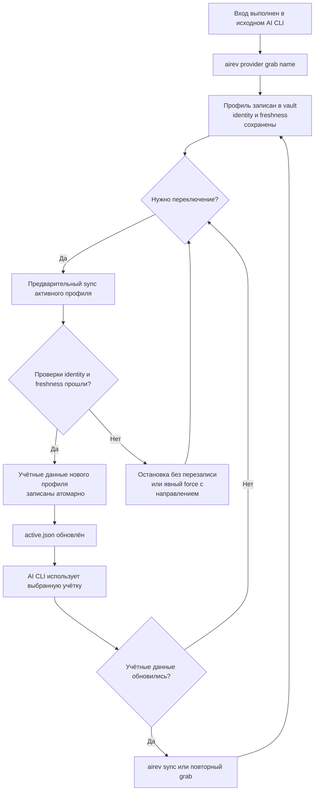

# Жизненный цикл профиля

## Назначение

Эта инструкция описывает безопасный порядок захвата, переключения,
синхронизации, переноса и удаления профиля. Команды выполняются из shell
текущего пользователя. Не запускай `airev` через `sudo`: это выберет другой
home directory и другой OS keyring.

## Поток данных

Схема отрисована и проверена через Mermaid Chart.



## Предварительные условия

1. Проверь, что запущена ожидаемая версия:

   ```bash
   airev --version
   which airev
   ```

   В Windows используй `where.exe airev`.

2. Проверь backend и пути:

   ```bash
   airev vault status
   airev vault path
   ```

3. Перед изменением существующего набора создай encrypted export:

   ```bash
   airev vault export airev-backup.json
   ```

4. Войди в нужную учётную запись средствами исходного provider CLI.

## Захват

Создай новый профиль из текущего native credential file:

```bash
airev codex grab work
airev codex list
airev status
```

Первый `grab` создаёт profile id и делает профиль активным. Повторный `grab`
того же имени без `--force` не должен молча подменять существующий профиль.

Если исходный CLI намеренно обновил credentials того же аккаунта:

```bash
airev codex grab --force work
airev codex status
```

Не используй `--force`, если текущий native file принадлежит неизвестной
учётной записи. Сначала сравни provider account и вывод `status`.

## Переключение

```bash
airev codex switch personal
airev codex status
```

Перед записью incoming profile команда синхронизирует outgoing active profile.
Если pre-sync завершается ошибкой, native file нового профиля ещё не записан.

После успешного switch проверь сам provider CLI безопасной status-командой,
которая не выводит токены. Не передавай её raw output в публичный issue.

## Sync и конфликт

Сначала получи решение без записи:

```bash
airev codex sync work --dry-run
```

Обычный `sync` выбирает более свежую сторону после identity check. При
осознанном конфликте укажи источник явно:

```bash
airev codex sync work --force --push   # native/satellite file -> vault
airev codex sync work --force --pull   # vault -> native/satellite file
```

`--push` и `--pull` взаимоисключающие. `--force` без направления запрещён.

## Неактивная файловая копия

`render` создаёт satellite credential file для профиля, который не является
active main:

```bash
airev codex render personal
airev codex status
airev codex sync personal --dry-run
```

Удалить только satellite copy:

```bash
airev codex evict personal
```

`evict` не удаляет профиль из registry или vault. Не все provider CLIs умеют
запускаться напрямую с satellite path; этот способ зависит от исходного CLI.

## Перенос backend

Проверь источник и сначала оставь его:

```bash
airev vault status
airev vault migrate file --keep-source
airev vault status
```

Migration выполняет copy, re-read и verify. `--yes` удаляет проверенные source
entries после копирования. Не используй его до успешного чтения target и
резервного export.

## Перенос на другую машину

На исходной машине:

```bash
airev vault export airev-transfer.json
```

Передай файл защищённым каналом. На целевой машине:

```bash
airev vault import airev-transfer.json
airev list
airev status
```

Пароль transfer file не становится паролем локального `vault.enc`. После
проверки удали transfer file с обеих машин.

## Удаление

```bash
airev codex drop old
airev codex list
```

`drop` удаляет entry из vault, stale marker и profile metadata. Команда не
отзывает provider token на сервере. Для отзыва используй интерфейс поставщика.

## Откат

После ошибочного switch:

1. Не запускай provider CLI, который может сразу ротировать credentials.
2. Переключись на последний исправный профиль:

   ```bash
   airev codex switch work --force
   airev codex status
   ```

3. Если vault state повреждён, импортируй заранее созданный encrypted export:

   ```bash
   airev vault import airev-backup.json --replace --restore-active
   airev status
   ```

4. Проверь account identity в исходном CLI без вывода токена.

`switch --force` пропускает pre-sync исходящего профиля. Используй его только
для возврата к заведомо исправной vault copy; иначе можно потерять более свежий
native credential.

Типовые ошибки разобраны в [`../troubleshooting.md`](../troubleshooting.md).
