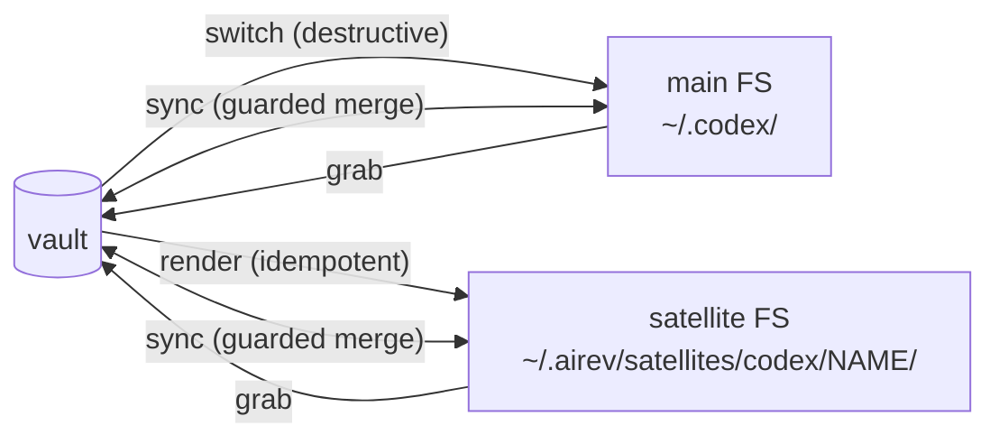

# CLI tree — airev после OAuth satellite router

Companion-схема к [2026-05-27-oauth-satellite-router-design.md](./2026-05-27-oauth-satellite-router-design.md).

Зелёное — новое в этой спеке. Жёлтое — расширенное.

```mermaid
flowchart TB
  airev(["airev"])

  airev --> list["list"]
  airev --> status_top["status [NAME] [--json]"]:::extended
  airev --> usage_top["usage [NAME]"]
  airev --> env["env [--shell SHELL]"]
  airev --> completion["completion SHELL"]
  airev --> provider_ns["provider"]
  airev --> vault_ns["vault"]
  airev --> prov(["⟨provider⟩&nbsp;&nbsp;codex | claude | gemini | qwen | copilot"])

  provider_ns --> p_list["list"]

  vault_ns --> v_path["path"]
  vault_ns --> v_status["status"]
  vault_ns --> v_passwd["passwd"]
  vault_ns --> v_export["export FILE [--plaintext]"]
  vault_ns --> v_import["import FILE [--replace] [--restore-active]"]
  vault_ns --> v_migrate["migrate {file|keyring} [--keep-source] [--yes]"]
  vault_ns --> v_unlock["unlock PROVIDER NAME"]:::new

  prov --> account_grp[["account ops"]]
  account_grp --> grab["grab NAME [--force]"]
  account_grp --> switch["switch NAME [--force]"]
  account_grp --> rename["rename OLD NEW"]
  account_grp --> drop["drop NAME"]

  prov --> satellite_grp[["satellite ops"]]
  satellite_grp --> render["render NAME [--force]"]:::new
  satellite_grp --> evict["evict NAME"]:::new

  prov --> drift_grp[["drift op"]]
  drift_grp --> sync["sync NAME [--dry-run] [--force --push|--pull]"]:::new

  prov --> read_grp[["read ops"]]
  read_grp --> usage_prov["usage [NAME]"]
  read_grp --> status_prov["status [NAME] [--json]"]:::extended

  classDef new fill:#d4edda,stroke:#28a745,color:#000
  classDef extended fill:#fff3cd,stroke:#ffc107,color:#000
```

## Симметрия по направлениям

## Принятые решения по реоргу

- **`unlock` → под `vault` namespace.** Применено: `airev vault unlock <provider> <name>`. Recovery-команда вынесена с горячего per-provider уровня.
- **Satellite sub-namespace** — отклонено: `sync` polymorphic, не лёг бы туда; ломает плоскую симметрию.
- **`drop`/`evict` rename** — отклонено: семантика разная, breaking change без выигрыша.
- **Симметричный split reverse** (`grab` → main + новый `capture` для satellite) — отклонено: у reverse нет destructive дельты, лишний verb.
- **`--json` унифицированно на `list`/`usage`/всех `status`** — out of V1 scope. Сейчас только для нового `status`. Фастфоллоу при необходимости.
